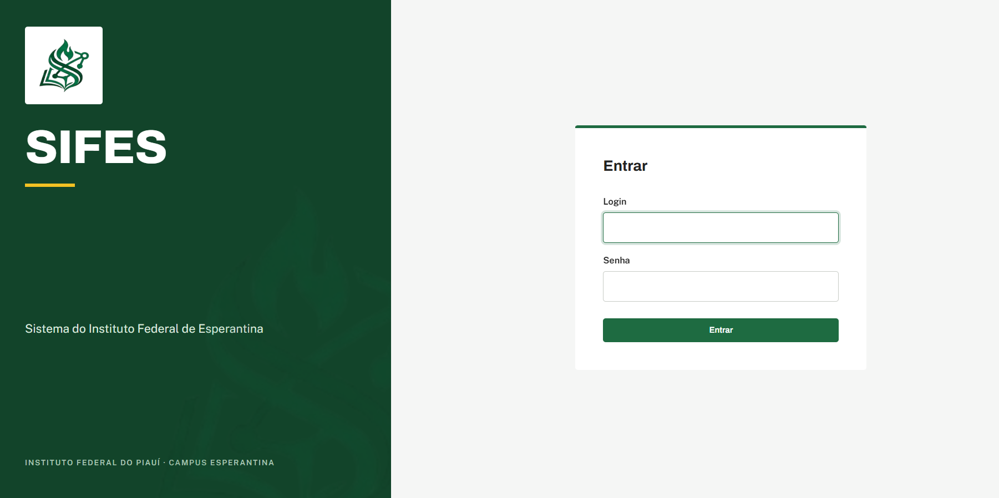
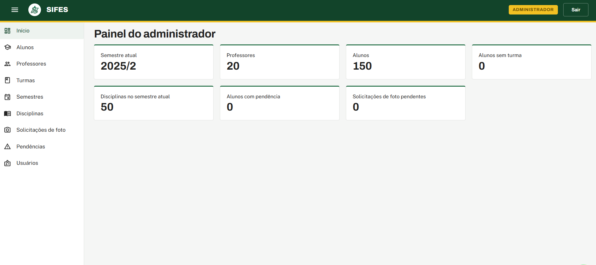
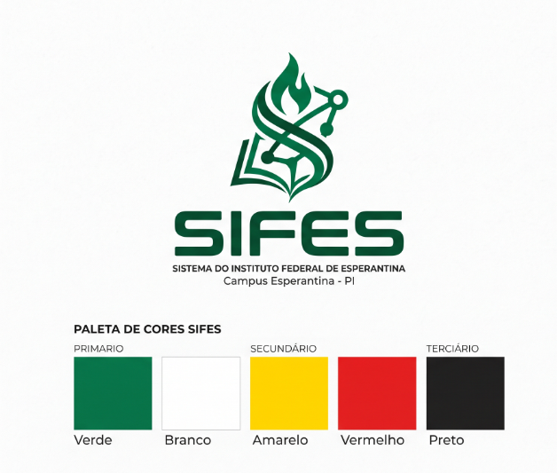

  

  # SIFES — Sistema do Instituto Federal de Esperantina

  Instituto Federal do Piauí - Campus Esperantina

---

## Finalidade

O **SIFES** é um sistema de gestão acadêmica desenvolvido para uso interno do **Instituto Federal do Piauí (IFPI) - Campus Esperantina**, enquanto o SUAP não pode ser utilizado pela instituição.

O sistema permite o controle de administradores, professores e alunos, cobrindo o gerenciamento de matérias, aulas, matrículas e presença, além da exportação de relatórios em PDF e Excel.

## Telas

  
  
Tela de login

  
  
Painel administrativo

## Documentação

- **[Backend](backend/README.md)** — API (NestJS + Prisma): como rodar em desenvolvimento, banco de dados e endpoints explicados.
- **[Frontend](frontend/README.md)** — SPA (React + Vite): como rodar em desenvolvimento, geração do client da API e build.

## Identidade Visual

  

**Paleta de cores**

| Cor | Uso | Hex aproximado |
|---|---|---|
| 🟩 Verde | Primária | `#1E6B41` |
| ⬜ Branco | Primária | `#FFFFFF` |
| 🟨 Amarelo | Secundária | `#F2C123` |
| 🟥 Vermelho | Secundária | `#E52625` |
| ⬛ Preto | Terciária | `#222222` |

## Stack

- **Linguagem:** TypeScript de ponta a ponta (front e back), com tipos gerados a partir do Swagger da API.
- **Frontend:** SPA em **React** + **Vite**, componentes visuais com **MUI**, roteamento com **React Router**, dados e cache com **TanStack Query**, formulários com **React Hook Form + Zod**, requisições HTTP com **Axios** e geração de cliente/hooks via **orval**.
- **Backend:** API REST em **NestJS**, organizada por módulos (usuários, professores, alunos, aulas, matérias), com autenticação e autorização via **refresh token**, guards de rota (**JWT** e **Roles**) e checagem de posse dos recursos.
- **Persistência:** **PostgreSQL** com ORM **Prisma** (schema, migrations e tipos gerados).
- **Infraestrutura:** **Docker Compose** orquestrando banco, API e front (build estático servido por Nginx).
- **Testes:** **Jest** no backend e **Vitest** no frontend.

## Créditos

Desenvolvido por **Mauro Gutemberg Magalhães Barros** para o **Instituto Federal do Piauí - Campus Esperantina**.
